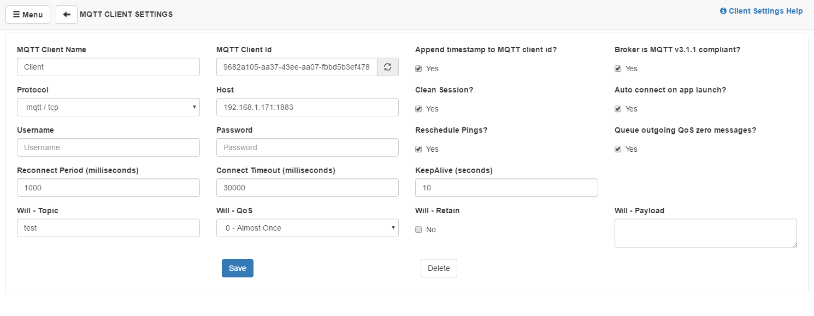
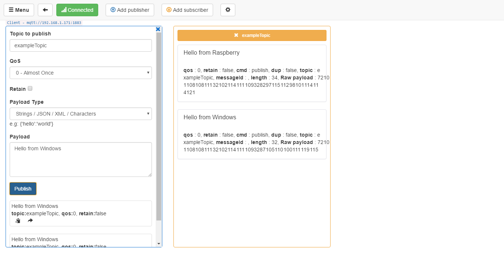

###Création d'un broker privé mosquitto###

Un Raspberry est parfait pour accueillir un broker MQTT, privé, ce qui permet d’éviter de faire transiter les messages sur le réseau public.
Parmi les broker, un serveur fréquemment utilisé est Mosquitto.

sudo apt-get install mosquitto mosquitto-clients

#Lorsque l’installation est terminée, démarrez le broker au démarrage du Rasberry ou de votre serveur :

sudo systemctl enable mosquitto.service

# Vérifiez que le broker soit démarré avec la commande :

sudo service mosquitto status

# C’est le port TCP 1883 qui est utilisé pour écouter les demandes d’un client ou d’un founisseur (subscriber), vous pouvez contrôler
# l’usage des ports avec netstat :

# Ouvrez une console dans laquelle vous déclarez un subscriber avec la commande :

mosquitto_sub -d -t exampleTopic

# Dans un autre terminal, publiez un message sur exampleTopic

mosquitto_pub -d -t exampleTopic -m "Hello world!"

# Vous verrez « Hello world! » affiché dans la première console, indiquant que le message a été reçu

# Un broker MQTT peut être testé avec le logiciel MQTTbox. Installez-le, et créez un client.

# Indiquez sur que topic vous publiez, et ajoutez éventuellement un subscriber :

Lorsque tout fonctionne, en publiant dans MQTTBox, le message est reçu dans la fenêtre subscriber exampleTopic de MQTTBox et dans la console du subscriber du RPi. Si vous publiez sur le RPi, le message sera aussi transmis à la fenêtre subscriber exampleTopic de MQTTBox.

voici le lien d'une autre docs sur ce sujet en anglais :

https://medium.com/gravio-edge-iot-platform/how-to-set-up-a-mosquitto-mqtt-broker-securely-using-client-certificates-82b2aaaef9c8